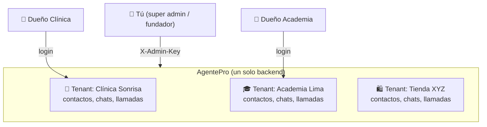
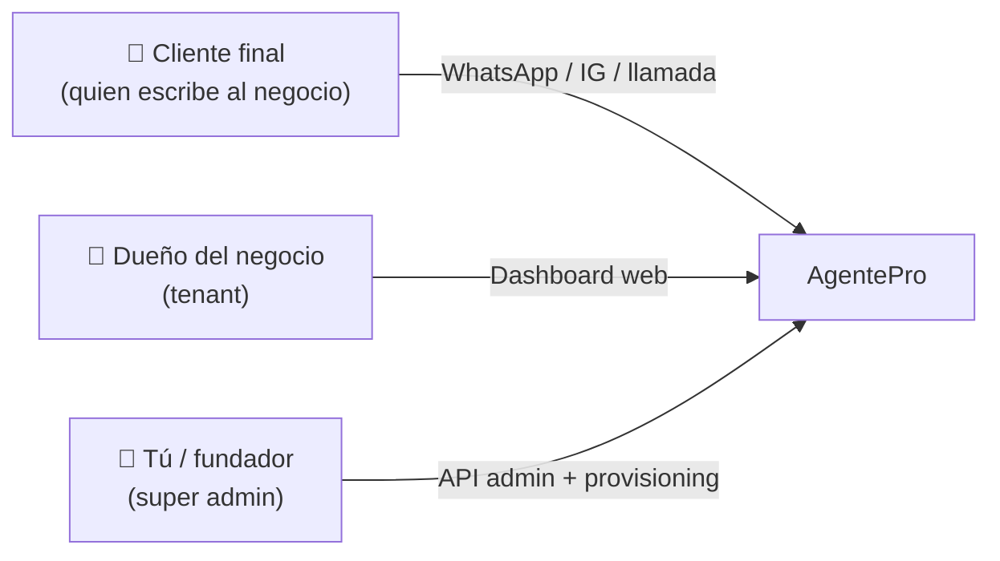

# 01 · Visión y conceptos

## ¿Qué es AgentePro 2.0?

Es una **plataforma SaaS de automatización con IA** para negocios pequeños y medianos del Perú y Latinoamérica. Cada negocio que se suscribe recibe, de forma automática, un equipo digital que trabaja 24/7:

| Módulo | Qué hace |
|--------|----------|
| 🤖 **Agente WhatsApp IA** | Responde mensajes 24/7, contesta preguntas frecuentes, califica leads y agenda citas |
| 📞 **Agente de voz IA** | Contesta y realiza llamadas telefónicas en español natural (vía Retell + Twilio) |
| 📇 **CRM automático** | Registra cada contacto, conversación y llamada en HubSpot sin intervención manual |
| ⚡ **Automatizaciones** | Seguimientos, recordatorios, reportes y campañas programadas (vía Modal + Celery) |
| 📸 **Generador de Instagram** | Crea posts (texto con Claude + imagen con fal.ai) listos para aprobar y publicar |
| 📊 **Dashboard unificado** | El dueño ve conversaciones, llamadas, contactos y métricas en tiempo real |
| 🪄 **Auto-provisioning** | Al pagar, todo lo anterior se configura solo en segundos |

## Conceptos fundamentales

### Multi-tenant (multi-inquilino)
Un **tenant** = un negocio cliente. Un solo backend atiende a muchos tenants a la vez. **Cada dato pertenece a un tenant** (`tenant_id`) y nunca se mezcla con otro. Cuando un usuario inicia sesión, todas sus consultas se filtran automáticamente por su `tenant_id`.

### Lead y "lead scoring"
Un **lead** es un contacto interesado. El agente IA evalúa cada mensaje y asigna un **puntaje (0-100)** y una **etapa**:

| Etapa (frontend) | Puntaje | Significado |
|------------------|---------|-------------|
| ❄️ `cold` (frío) | 0-33 | Solo curiosea |
| 🌤️ `warm` (tibio) | 34-66 | Muestra interés, pregunta precios |
| 🔥 `hot` (caliente) | 67-100 | Quiere comprar/agendar pronto |
| ⭐ `customer` | — | Ya es cliente |
| 💤 `lost` | — | Inactivo o bloqueado |

> Internamente el contacto guarda `qualification_score` (0-100) y un `status` (`lead/prospect/customer/...`). El backend traduce eso a la etapa que ve el dashboard (`derive_lead_stage` en `app/utils/helpers.py`).

### Escalado a humano
Si el cliente se molesta, dice palabras clave ("urgente", "queja", "hablar con una persona") o el bot no puede resolver, el agente **escala**: marca la conversación, notifica al dueño (toast en el dashboard + email) y deja de responder hasta que un humano tome el control ("Tomar control" / "Devolver a IA").

### Planes
| Plan | Mensajes/mes | Llamadas/mes | Extras |
|------|--------------|--------------|--------|
| **Inicial** (S/149) | 200 | — | Solo WhatsApp IA: Dashboard, Conversaciones, Agente, Configuración |
| **Basic** (S/249) | 400 | — | + Contactos (CRM) |
| **Professional** (S/449) | 1,500 | 60 | + Instagram, Citas + recordatorios, voz, reporte semanal |
| **Enterprise** (S/799) | 4,000 | 150 | + Automatizaciones/reactivación, soporte prioritario |

Ver detalle económico en `agentepro/PRICING.md`.

## ¿Quiénes usan el sistema?

1. **Cliente final:** no usa la app; solo escribe al WhatsApp/Instagram del negocio o llama por teléfono.
2. **Dueño del negocio (tenant):** entra al dashboard a ver y gestionar todo.
3. **Tú (super admin / fundador):** das de alta negocios, ves métricas globales y administras la plataforma (ver [doc 06](06-cuentas-roles-y-superadmin.md)).

## Siguiente
➡️ [02 · Arquitectura](02-arquitectura.md)
