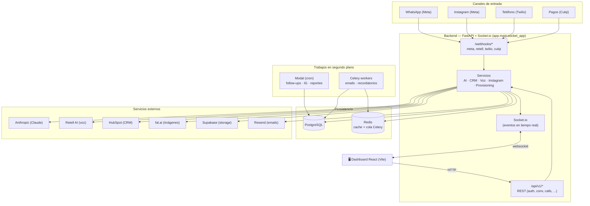

# 02 · Arquitectura

## Vista general

## Componentes

### 1. Backend (`agentepro/backend/app`)
Un único proceso ASGI que combina **FastAPI** (HTTP) y **Socket.io** (tiempo real), expuesto como `app.main:socket_app`.

| Carpeta | Responsabilidad |
|---------|-----------------|
| `api/v1/` | Endpoints REST agrupados por recurso (auth, conversations, calls, contacts, instagram, automations, agent, voice, metrics, subscriptions, provisioning, admin, tenants) |
| `webhooks/` | Reciben eventos externos: `meta_whatsapp`, `meta_instagram`, `retell`, `twilio_voice`, `culqi` |
| `services/` | Lógica de negocio: `ai/`, `crm/`, `voice/`, `instagram/`, `provisioning/`, y servicios sueltos (`conversation_service`, `contact_service`, `call_service`, `metrics_service`, `notification_service`, `culqi_service`) |
| `models/` | 15 modelos SQLAlchemy 2.0 (ver [doc 03](03-modelo-de-datos.md)) |
| `schemas/` | Esquemas Pydantic v2 (validación de entrada/salida de la API) |
| `core/` | `security` (JWT, hashing, HMAC), `socket` (Socket.io), `middleware`, `exceptions` |
| `utils/` | `encryption` (Fernet), `logger` (structlog), `helpers` |
| `modal_tasks/` | Tareas programadas en la nube (Modal) |
| `workers/` | Tareas Celery (emails, recordatorios) |
| `main.py` | Arma la app, monta routers, webhooks y Socket.io |

### 2. Frontend (`agentepro/frontend/src`)
SPA en **React 19 + TypeScript estricto + Vite + Tailwind**. Habla con el backend por HTTP (`/api/v1`) y por websocket (Socket.io). Ver [doc 09](09-frontend-dashboard.md).

### 3. PostgreSQL
Base de datos principal. Migraciones con **Alembic** (`alembic/versions/001_*`, `002_*`).

### 4. Redis
Cache, rate limiting y **broker de Celery**.

### 5. Trabajos asíncronos
- **Modal:** crons en la nube (seguimientos diarios, posts de Instagram semanales, reportes). Ver `modal_tasks/`.
- **Celery + Redis:** tareas disparadas por la app (emails, recordatorios). Ver `workers/`.

## Cómo se comunican (resumen)

| De | A | Cómo |
|----|----|------|
| Cliente final | Backend | Webhooks (Meta/Twilio/Retell) |
| Dashboard | Backend | HTTP REST con `Authorization: Bearer <JWT>` |
| Backend | Dashboard | Socket.io (eventos `new_message`, `escalation_needed`, `new_call`...) |
| Backend | Claude/HubSpot/etc. | HTTPS (httpx o SDK) |
| Backend | DB | SQLAlchemy async (asyncpg) |
| Alembic | DB | SQLAlchemy sync (psycopg2) |

## Stack tecnológico (versiones)

**Backend:** Python 3.13 · FastAPI 0.115+ · SQLAlchemy 2.0 async (asyncpg) · Alembic · Pydantic v2 · anthropic SDK · httpx · python-jose (JWT) · passlib + bcrypt · redis · celery · structlog · cryptography (Fernet) · python-socketio · retell-sdk · twilio · hubspot-api-client · modal · resend · fal-client.

**Frontend:** React 19 · Vite 6 · TypeScript 5.7 (strict) · Tailwind · React Router 7 · TanStack Query 5 · Recharts · Zustand · socket.io-client · lucide-react.

## Seguridad (resumen)
- **JWT** en cada endpoint privado (access 30 min + refresh 30 días).
- **HMAC-SHA256** para validar firmas de webhooks de Meta y Culqi.
- **Fernet** para cifrar tokens de terceros (WhatsApp/Instagram) en la base de datos.
- **`X-Admin-Key`** para endpoints de plataforma (`/admin/*`, `/provision`).
- Aislamiento por `tenant_id` en todas las consultas.

## Patrón importante: webhooks responden rápido
Los webhooks de WhatsApp/Instagram **siempre responden `200` inmediatamente** y procesan el mensaje en **segundo plano** (`BackgroundTasks` con su propia sesión de DB). Esto evita timeouts de Meta y reintentos duplicados (que además se filtran por `wa_message_id` único).

## Siguiente
➡️ [03 · Modelo de datos](03-modelo-de-datos.md)
