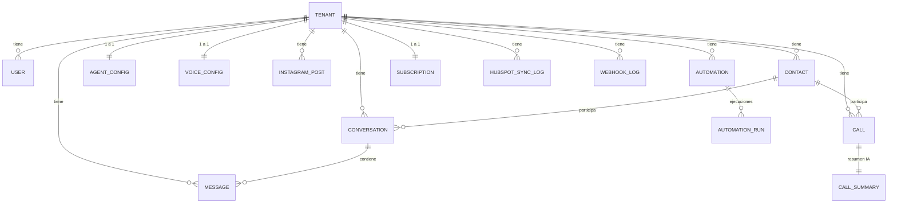

# 03 · Modelo de datos

15 tablas, todas (excepto la raíz `tenants` y `users`) cuelgan de un **tenant**. Identificadores `UUID`, timestamps `created_at`/`updated_at`, campos flexibles en `JSON`.

## Diagrama entidad-relación

## Tablas principales

### `tenants` — el negocio cliente
Raíz de todo. Campos clave: `name`, `slug` (único, usado en URLs de webhook), `business_type`, `plan`, credenciales cifradas (`whatsapp_access_token`, `instagram_access_token`), `webhook_verify_token`, `twilio_phone_number`, `retell_agent_id`, `hubspot_company_id`, contadores de uso (`messages_used_this_month`, `calls_used_this_month`), `is_active`, `is_provisioned`, `trial_ends_at`.

### `users` — quien entra al dashboard
`email` (único), `hashed_password` (bcrypt), `full_name`, `role` (`owner/admin/agent/superadmin`), `tenant_id`. Ver [doc 06](06-cuentas-roles-y-superadmin.md).

### `contacts` — el cliente final del negocio
`wa_id` (número WhatsApp), `phone_number`, `full_name`, `email`, `status` (`lead/prospect/customer/inactive/blocked`), `qualification_score` (0-100), `primary_channel`, `tags` (JSON), `hubspot_contact_id`, `opted_in` (consentimiento / "no contactar"), `last_interaction_at`.

### `conversations` — un hilo de chat
`contact_id`, `channel` (`whatsapp/instagram/voice/web`), `status` (`open/in_progress/waiting/escalated/closed`), `assignee_type` (`ai/human`), contadores (`message_count`, `unread_count`, `tokens_used`), `tags`, `last_message_at`.

### `messages` — cada mensaje
`conversation_id`, `wa_message_id` (**único**, anti-duplicados), `direction` (`inbound/outbound`), `sender_type` (`contact/ai/human/system`), `message_type` (`text/audio/image/...`), `content`, `transcription`, `tokens_used`, `is_read`.

### `agent_config` — cerebro del agente de chat (1 por tenant)
`agent_name`, `welcome_message`, `business_hours` (JSON por día), `outside_hours_message`, `faqs` (JSON), `services` (JSON con precios), `escalation_keywords`, `escalation_phone/email`, `lead_qualification_questions`, flags de HubSpot (`auto_create_hubspot_contacts/deals`).

### `voice_config` — agente de voz (1 por tenant)
`retell_agent_id`, `voice_id`, `agent_name`, `welcome_message`, `direction`, `max_call_duration_seconds`, `outbound_calling_hours` (JSON), `enable_recording/transcription/summary`.

### `calls` — llamadas telefónicas
`contact_id`, `retell_call_id` / `twilio_call_sid`, `direction`, `from/to_number`, `status`, `duration_seconds`, `recording_url`, `transcription`, `sentiment`, `intent`. (El atributo Python es `call_metadata` → columna DB `metadata`.)

### `call_summaries` — resumen IA de la llamada (1 por call)
`summary`, `key_points` (JSON), `action_items` (JSON), `overall_sentiment`, `call_outcome`, `follow_up_required`, `intent_detected`, ids de HubSpot.

### `instagram_posts`
`caption`, `ai_generated_caption`, `ai_generated_image_url`, `hashtags` (JSON), `status` (`draft/scheduled/publishing/published/failed`), `scheduled_for`, `published_at`, métricas (`likes_count`, `comments_count`). (Atributo `post_metadata` → columna DB `metadata`; ahí se guarda `pending_approval`/`rejected`.)

### `automations` + `automation_runs`
Reglas de automatización (`automation_type`, `status`, `trigger_config`, `cron_expression`) y su historial de ejecuciones (`messages_sent`, `status`, `completed_at`).

### `subscriptions`
Plan, estado (`active/past_due/cancelled/trialing`), datos de Culqi, período de facturación, monto.

### Auditoría
- `webhook_logs`: cada webhook recibido (fuente, evento, payload, estado).
- `hubspot_sync_logs`: cada sincronización con HubSpot (entidad, acción, éxito/fallo).

## Notas técnicas (decisiones no obvias)
- **`metadata` es palabra reservada** por la API declarativa de SQLAlchemy. Por eso `Call.call_metadata` e `InstagramPost.post_metadata` son los atributos Python, mapeados a la columna física `"metadata"`.
- El enum de dirección de voz se llama `voice_call_direction_enum` para no chocar con el `call_direction_enum` de `calls`.
- La API **traduce** el modelo interno al contrato del frontend (p. ej. `qualification_score` → `lead_score`; `status` del contacto → `lead_stage`).

## Siguiente
➡️ [04 · Flujos clave](04-flujos-clave.md)
