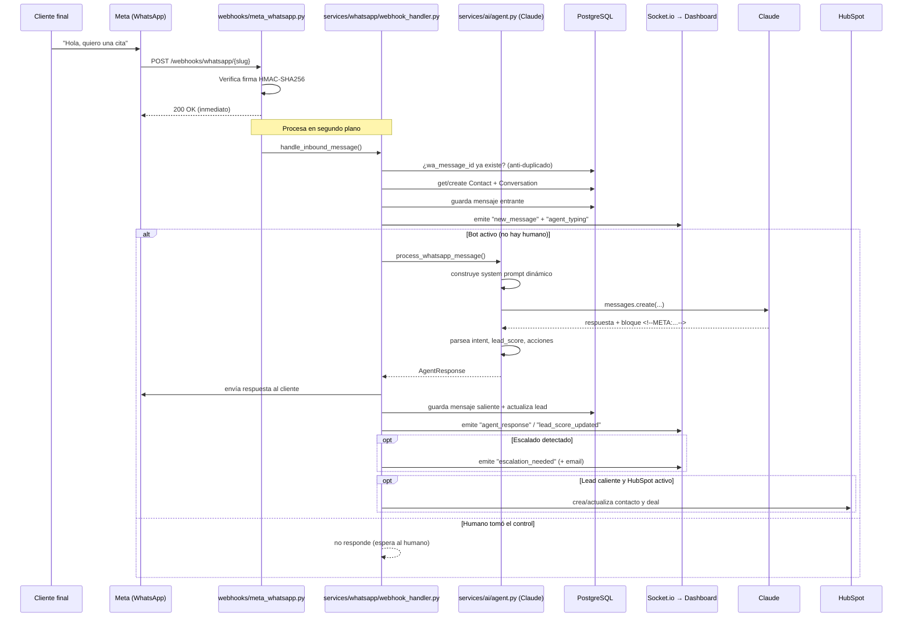
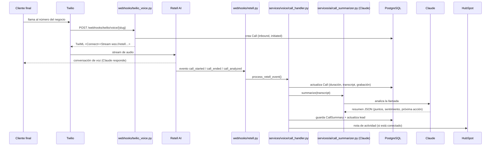
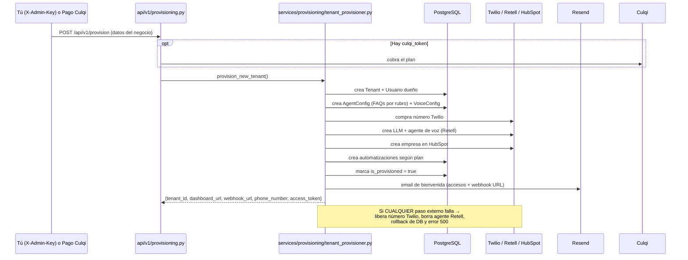
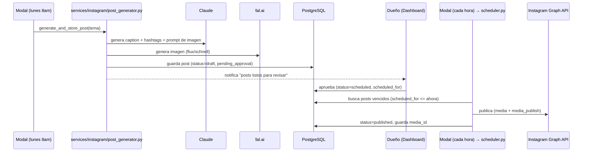
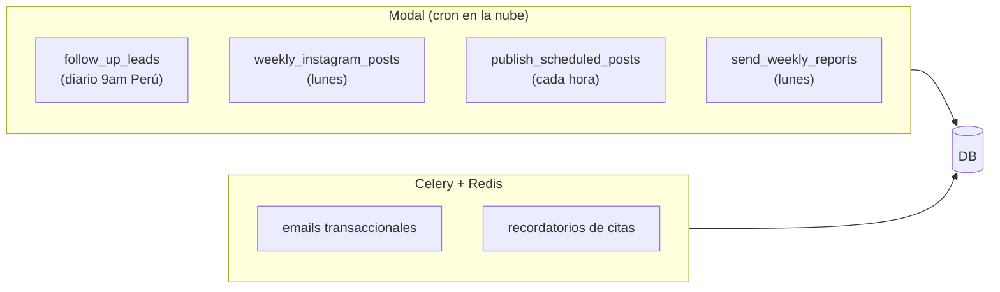

# 04 · Flujos clave

Diagramas de secuencia de los procesos más importantes. Cada uno indica el archivo donde vive la lógica.

---

## A. Mensaje entrante de WhatsApp (el flujo estrella)

**Sin `ANTHROPIC_API_KEY`:** todo el flujo corre igual, pero `Claude` falla y el agente devuelve un mensaje de respaldo ("Disculpe, tuve un problema técnico…"), que igual se guarda. Por eso **puedes probar el flujo completo sin keys**.

---

## B. Llamada de voz entrante

---

## C. Auto-provisioning (alta de un nuevo negocio)

**Sin keys externas:** el provisioning **igual funciona**: crea el tenant, usuario, configs y automatizaciones en la base; los pasos de Twilio/Retell/HubSpot simplemente devuelven `None` (degradación con gracia) y `phone_number` queda en `null`.

---

## D. Generación y publicación de Instagram

---

## E. Automatizaciones programadas

## Siguiente
➡️ [05 · Referencia de la API](05-api-referencia.md)
