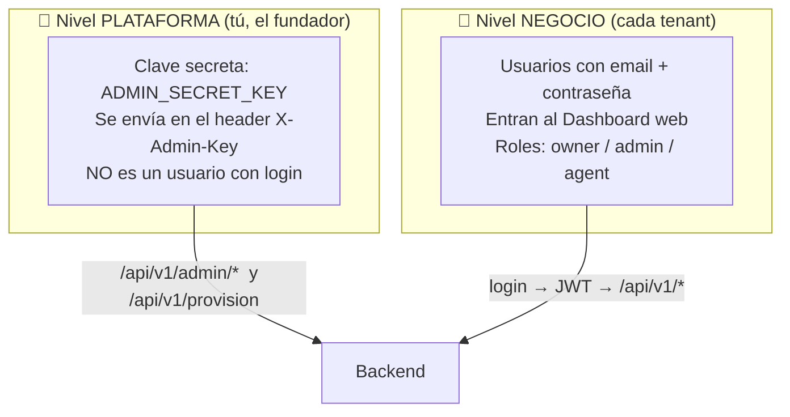
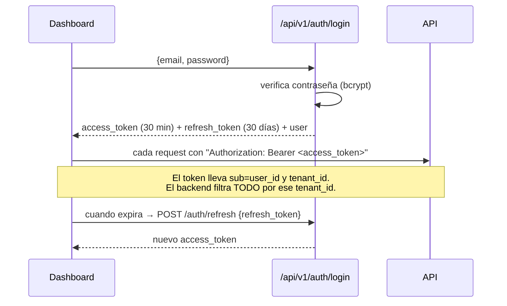

# 06 · Cuentas, roles y super admin

Hay **dos niveles de acceso** muy distintos en AgentePro. Es la duda más común, así que va claro:



---

## 🦸 Tu cuenta de SUPER ADMIN (nivel plataforma)

> **No es un usuario con correo y contraseña.** Es una **clave secreta** que viaja en un header HTTP. Así administras toda la plataforma (das de alta negocios, ves métricas globales, desactivas tenants).

- **Variable:** `ADMIN_SECRET_KEY`
- **Valor actual (desarrollo):** `dev-admin-key`  ← definido en `agentepro/backend/.env`
- **Cómo se usa:** en el header `X-Admin-Key: dev-admin-key`
- **Qué desbloquea:** todos los endpoints `/api/v1/admin/*` y el `POST /api/v1/provision`.

### Ejemplos
```bash
# Ver todos los negocios de la plataforma
curl http://localhost:8000/api/v1/admin/tenants -H "X-Admin-Key: dev-admin-key"

# Estado de las integraciones (qué keys tienes configuradas)
curl http://localhost:8000/api/v1/admin/health -H "X-Admin-Key: dev-admin-key"

# Dar de alta un negocio nuevo (sin cobro, como admin)
curl -X POST http://localhost:8000/api/v1/provision \
  -H "Content-Type: application/json" -H "X-Admin-Key: dev-admin-key" \
  -d '{"business_name":"Mi Negocio","business_type":"services","owner_name":"Tú","owner_email":"tu@correo.pe","owner_phone":"+51999999999","plan":"professional"}'
```

> ⚠️ **En producción cambia `ADMIN_SECRET_KEY`** por algo largo y secreto (`openssl rand -hex 32`). Quien tenga esa clave controla toda la plataforma.

> 📌 No hay (todavía) una **pantalla web** de super admin: la administración de plataforma es por API. El dashboard web es por-negocio.

---

## 👔 Cuentas de NEGOCIO (nivel tenant — el Dashboard)

Cada negocio tiene usuarios que entran al dashboard en **http://localhost:5173**.

### Tu cuenta de prueba (ya creada y lista)
| Campo | Valor |
|-------|-------|
| **Email** | `dueno@clinicasonrisa.pe` |
| **Contraseña** | `secret123` |
| **Negocio** | Clínica Sonrisa |
| **Rol** | `owner` |
| **Plan** | trial |

Esta cuenta se creó vía `POST /auth/register` durante las pruebas. **Úsala para entrar al dashboard.**

> El otro negocio de prueba ("Academia Lima", creado con `/provision`) tiene una contraseña **temporal autogenerada** que normalmente se envía por email (Resend). Como aún no hay key de Resend, no la verás; para ese negocio usa el `access_token` que devolvió el endpoint, o simplemente trabaja con Clínica Sonrisa / crea uno nuevo desde "Regístrate".

### Roles de usuario
Definidos en `app/models/user.py` (`UserRole`):

| Rol | Pensado para |
|-----|--------------|
| `owner` | Dueño del negocio (acceso total a su tenant). Es el que crea el registro. |
| `admin` | Administrador del negocio |
| `agent` | Operador que atiende conversaciones |
| `superadmin` | Reservado para staff de la plataforma (aún sin endpoint que lo cree automáticamente) |

> Hoy todos los usuarios de un tenant ven todo lo de **su** tenant; los roles están modelados para diferenciar permisos más adelante.

---

## 🔐 Cómo funciona el login (JWT)



- **access_token:** vida corta (30 min), se manda en cada llamada.
- **refresh_token:** vida larga (30 días), sirve para renovar sin re-loguear.
- El frontend los guarda en `localStorage` (store de Zustand `agentepro-auth`) y los adjunta automáticamente (`lib/api.ts`).

## ¿Cómo crear un `superadmin` real (opcional, futuro)?
Hoy no hay endpoint para ello. Cuando lo necesites, las opciones son: (a) un script de *seed* que inserte un `User` con `role=superadmin` y `tenant_id=NULL`, o (b) insertarlo directo en la tabla `users` con la contraseña ya hasheada (`get_password_hash` en `app/core/security.py`). Por ahora, **la administración de plataforma se hace con `X-Admin-Key`**.

## Siguiente
➡️ [07 · Guía de pruebas](07-guia-de-pruebas.md)
