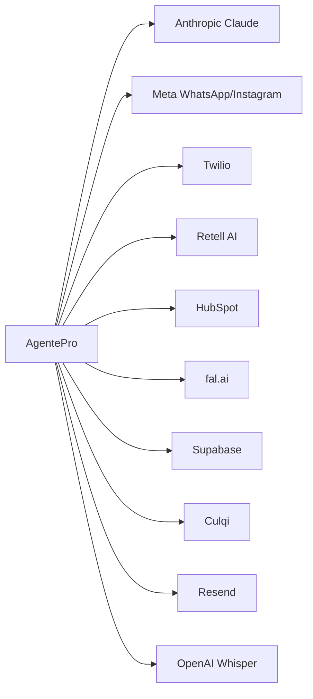

# 08 · Integraciones externas

Cada servicio externo está **encapsulado** en un cliente propio y **degrada con gracia**: si falta la clave, esa función se desactiva (devuelve `None` / mensaje de respaldo) sin romper la app. Revisa qué tienes activo con `GET /api/v1/admin/health`.

| Servicio | Variable(s) | Para qué | Archivo cliente | Si falta la key |
|----------|-------------|----------|-----------------|-----------------|
| **Anthropic (Claude)** | `ANTHROPIC_API_KEY` | Cerebro del agente: chat, resúmenes de llamada, captions de IG | `services/ai/agent.py`, `call_summarizer.py`, `instagram_content_generator.py` | El agente responde con un **mensaje de respaldo**; el flujo igual corre |
| **Meta WhatsApp** | `META_APP_ID`, `META_APP_SECRET`, `META_VERIFY_TOKEN_SECRET` + token del tenant | Recibir/enviar WhatsApp | `services/whatsapp/client.py` | Webhook verifica igual; el envío se omite (en DEBUG se loguea) |
| **Meta Instagram** | `META_INSTAGRAM_APP_ID/SECRET` | DMs y publicar posts | `services/instagram/client.py` | No publica/responde IG |
| **Twilio** | `TWILIO_ACCOUNT_SID`, `TWILIO_AUTH_TOKEN`, `TWILIO_DEFAULT_PHONE_NUMBER` | Comprar número, enrutar llamadas | `services/voice/twilio_client.py` | Provisioning deja `twilio_phone_number=null` |
| **Retell AI** | `RETELL_API_KEY`, `RETELL_WEBHOOK_SECRET`, `RETELL_DEFAULT_VOICE_ID` | Agente de voz (usa Claude como LLM) | `services/voice/retell_client.py` | No crea agente de voz; webhook acepta igual |
| **HubSpot** | `HUBSPOT_ACCESS_TOKEN` | CRM: contactos, deals, notas, tareas | `services/crm/hubspot_client.py` | No sincroniza (silencioso) |
| **fal.ai** | `FAL_KEY` | Generar imágenes de los posts | usado por `instagram_content_generator.py` | Post se crea sin imagen |
| **Supabase** | `SUPABASE_URL`, `SUPABASE_KEY` | Storage de grabaciones/imágenes | — | Sin storage externo |
| **Culqi** | `CULQI_SECRET_KEY`, `CULQI_WEBHOOK_SECRET` | Cobros (tarjeta/Yape, Perú) | `services/culqi_service.py` | Cobro simulado (`chr_simulated`) |
| **Resend** | `RESEND_API_KEY`, `RESEND_FROM_EMAIL` | Emails (bienvenida, alertas) | `services/notification_service.py` | Email omitido (se loguea) |
| **OpenAI (Whisper)** | `OPENAI_API_KEY` | Transcribir audios de WhatsApp | `modal_tasks/audio_transcriber.py` | No transcribe audios |

## Detalle por integración

### Anthropic (Claude) — el corazón
- Modelos: `CLAUDE_MODEL_DEFAULT` (chat) y `CLAUDE_MODEL_COMPLEX` (voz/tareas complejas).
- El **system prompt es dinámico** por negocio (`services/ai/prompt_builder.py`): inyecta identidad, horario, FAQs, servicios, reglas de escalado y pide a Claude un bloque oculto `<!--META:...-->` con `intent`, `lead_score`, etc.
- **Es lo primero que deberías configurar** para ver el producto "vivo".

### Meta WhatsApp — el canal principal
- Cada tenant tiene su **URL de webhook**: `/webhooks/whatsapp/<slug>` y su `webhook_verify_token`.
- Firma validada con HMAC-SHA256 (`META_APP_SECRET`). Token de acceso del tenant **cifrado con Fernet** en la DB.
- Guía paso a paso en `agentepro/README.md` (sección 6) y `NEXT_STEPS.md`.

### Twilio + Retell — la voz
- Llamada entrante → Twilio pega a `/webhooks/twilio/voice/<slug>` → respondemos **TwiML** que conecta el audio a Retell por websocket → Retell usa Claude → al terminar, Retell manda eventos a `/webhooks/retell/<slug>` y generamos el resumen.

### HubSpot — el CRM
- Se crea/actualiza el contacto, se agregan notas de actividad y, si un lead se pone caliente, se crea un **deal** automáticamente.

## Orden recomendado para activar
1. **Anthropic** (ver el agente real). 2. **Meta WhatsApp**. 3. **Resend**. 4. **HubSpot**. 5. **Twilio + Retell**. 6. **fal.ai**. 7. **Culqi**.

> Pasos exactos por consola en `agentepro/NEXT_STEPS.md`.

## Siguiente
➡️ [09 · Frontend / Dashboard](09-frontend-dashboard.md)
