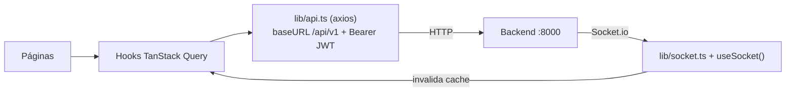

# 09 · Frontend / Dashboard

SPA en **React 19 + TypeScript estricto + Vite + Tailwind**, en `agentepro/frontend`. Tema oscuro ejecutivo con acento verde esmeralda.

## Estructura

```
frontend/src/
├── main.tsx            # punto de entrada (QueryClientProvider)
├── App.tsx             # RouterProvider + Toaster + useSocket()
├── router.tsx          # rutas (ProtectedRoute por JWT)
├── lib/                # api.ts (axios), socket.ts, auth.ts, utils.ts
├── stores/             # auth.store.ts (Zustand, persistido), ui.store.ts (toasts)
├── hooks/              # useConversations, useMessages, useCalls, useContacts,
│                       # useInstagram, useAutomations, useMetrics, useSocket
├── components/         # layout (Sidebar, TopBar, AppLayout), common, conversations
└── pages/              # las 11 páginas (auth, dashboard, conversations, calls,
                        # contacts, instagram, automations, agent, settings, onboarding)
```

## Páginas

| Ruta | Página | Qué muestra |
|------|--------|-------------|
| `/login`, `/register` | Auth | Entrar / crear negocio |
| `/onboarding` | Onboarding | 4 pasos guiados post-registro |
| `/` | Dashboard | KPIs (mensajes, leads, llamadas, calientes) + gráficos Recharts |
| `/conversations` | Conversaciones | Lista + hilo estilo WhatsApp Web; tomar/devolver control; enviar mensaje |
| `/calls` | Llamadas | Lista + detalle con transcript, resumen IA y reproductor de audio |
| `/contacts` | Contactos | Pipeline Kanban (frío/tibio/caliente/cliente) |
| `/instagram` | Instagram | Grid de posts; generar, aprobar, rechazar |
| `/automations` | Automatizaciones | Tarjetas con toggle on/off y "ejecutar ahora" |
| `/agent` | Agente IA | Editor de config + **panel de prueba en vivo** |
| `/settings` | Configuración | Datos del negocio, uso del mes, **URL de webhook** |

## Cómo habla con el backend



- **TanStack Query** maneja fetching, cache y *refetch*. Los hooks (`useConversations`, etc.) encapsulan cada endpoint.
- **Socket.io** (`useSocket`) escucha eventos del backend y **invalida** la cache de React Query → la UI se actualiza sola (mensajes nuevos, llamadas, posts listos) y muestra toasts.
- **Zustand** (`auth.store`) guarda el JWT en `localStorage`; `lib/api.ts` lo adjunta en cada request y, ante un `401`, hace logout y redirige a `/login`.

### El proxy de desarrollo (importante)
El frontend usa rutas **relativas** (`/api/v1`, `/socket.io`). Vite las **proxea** al backend:
- En **local** (sin Docker): a `http://localhost:8000`.
- En **Docker**: a `http://backend:8000` (variable `VITE_PROXY_TARGET`, fijada en `docker-compose.yml`).

Ver `frontend/vite.config.ts`.

## Diseño (tokens Tailwind)
| Token | Color | Uso |
|-------|-------|-----|
| `background` | `#0A0F1E` | Fondo |
| `card` | `#111827` | Tarjetas |
| `primary` | `#10B981` | Verde (dinero/éxito) |
| `secondary` | `#3B82F6` | Azul (confianza) |
| `warning` | `#F59E0B` | Ámbar (alertas) |

Fuentes: **Syne** (títulos), **Inter** (texto). Clases utilitarias propias en `index.css`: `.input-base`, `.card-base`, `.btn-primary`.

## Build de producción
```bash
cd agentepro/frontend
npm install --legacy-peer-deps   # React 19 ⇒ usar --legacy-peer-deps
npm run build                    # tsc estricto + vite build  (✅ pasa)
```

## Siguiente
➡️ [10 · Operación y despliegue](10-operacion-y-despliegue.md)
