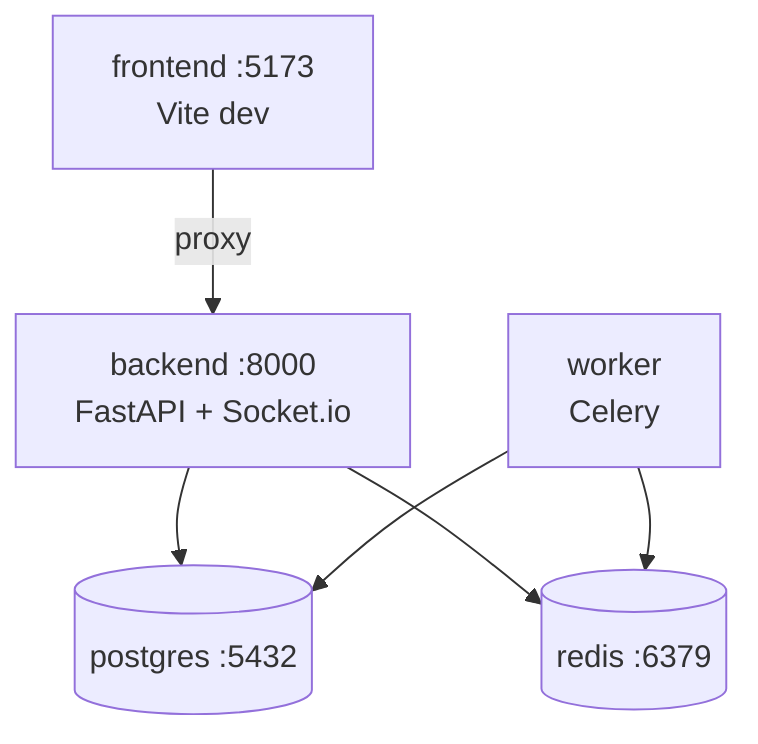

# 10 · Operación y despliegue

## Local con Docker Compose (lo que está corriendo ahora)

```bash
cd agentepro
docker compose up -d --build      # levanta todo
docker compose ps                 # ver estado
docker compose logs -f backend    # ver logs del backend
docker compose down               # detener (conserva datos)
docker compose down -v            # detener y BORRAR datos (postgres/redis)
```

### Servicios del compose


| Servicio | Puerto | Comando |
|----------|--------|---------|
| postgres | 5432 | imagen `postgres:16-alpine` |
| redis | 6379 | imagen `redis:7-alpine` |
| backend | 8000 | `alembic upgrade head && uvicorn app.main:socket_app --reload` |
| worker | — | `celery -A app.workers.celery_app worker` |
| frontend | 5173 | `npm run dev -- --host` (proxy a `backend:8000`) |

> El backend **corre las migraciones al arrancar** (`alembic upgrade head`). La primera vez crea las 15 tablas (migraciones `001` y `002`).

### Variables de entorno
- Backend: `agentepro/backend/.env` (plantilla en `.env.example`). En Docker, `DATABASE_URL`/`REDIS_URL` usan hosts internos `postgres`/`redis`.
- Frontend: `agentepro/frontend/.env` (+ `VITE_PROXY_TARGET=http://backend:8000` en el compose).

## Migraciones (Alembic)
```bash
# dentro del contenedor backend (o local con backend/.env)
docker compose exec backend alembic upgrade head        # aplicar
docker compose exec backend alembic revision -m "cambio" --autogenerate
docker compose exec backend alembic downgrade -1        # revertir
```
- `alembic/env.py` usa `DATABASE_URL_SYNC` (driver **psycopg2**).
- La app usa `DATABASE_URL` (driver async **asyncpg**).

## Trabajos en segundo plano

### Celery (incluido en el compose)
- Worker: procesa emails y recordatorios.
- Beat (opcional, en `docker-compose.prod.yml`): dispara tareas periódicas.

### Modal (cron en la nube — se despliega aparte)
```bash
pip install modal
modal token new
modal secret create agentepro-secrets DATABASE_URL=... ANTHROPIC_API_KEY=... # etc.
modal deploy app/modal_tasks/follow_up_leads.py
modal deploy app/modal_tasks/instagram_scheduler.py
modal deploy app/modal_tasks/weekly_reports.py
```
Tareas: seguimiento diario de leads, generación/publicación de posts de IG, reportes semanales, transcripción de audios.

## Backups de la base de datos

El servicio **`backup`** (en `docker-compose.yml` y `docker-compose.prod.yml`) usa la
imagen `postgres:16-alpine` para correr `pg_dump` en formato *custom*:

- Hace una copia **al arrancar** y luego **cada `BACKUP_INTERVAL_SECONDS`** (def. 1 día).
- Guarda los `.dump` en `agentepro/backups/` (host) y **rota** los de más de `BACKUP_RETENTION_DAYS` días.
- Si un backup falla, el servicio **no se cae**: registra el error y reintenta al ciclo siguiente.

```bash
docker compose up -d backup                              # arrancar
docker compose logs -f backup                            # ver "Backup OK: ..."
docker compose exec backup sh /scripts/backup_db.sh      # backup manual ahora
ls -lh backups/                                          # listar copias
# Restaurar (⚠️ reemplaza los datos actuales):
docker compose exec backup sh /scripts/restore_db.sh /backups/agentepro_AAAAMMDD_HHMMSS.dump
```

Scripts en `agentepro/scripts/` (`backup_db.sh`, `backup_loop.sh`, `restore_db.sh`),
documentados en `scripts/README.md`.

> **Producción:** si la BD es externa (Supabase/Railway con backups gestionados), este
> servicio es una copia extra opcional. Define `PGHOST/PGPORT/PGUSER/PGPASSWORD/PGDATABASE`
> en `backend/.env`. **Recomendado:** subir los `.dump` a almacenamiento externo (S3/Supabase)
> para sobrevivir a la pérdida del servidor completo.

## Despliegue a producción

| Componente | Plataforma | Archivo |
|------------|------------|---------|
| Backend + workers | **Railway** | `backend/railway.json` (Dockerfile, corre migraciones en el start) |
| Frontend | **Vercel** | `frontend/vercel.json` (Vite, rewrites SPA) |
| Base de datos / storage | **Supabase** | `DATABASE_URL`, `SUPABASE_*` |
| Crons | **Modal** | `modal deploy ...` |

Checklist de producción:
- [ ] Cambiar `SECRET_KEY` y `ADMIN_SECRET_KEY` por valores fuertes.
- [ ] `DEBUG=false` (oculta `/docs`).
- [ ] `FRONTEND_URL` apuntando al dominio real (afecta CORS y Socket.io).
- [ ] Webhooks de Meta/Twilio/Retell/Culqi apuntando al dominio público del backend.
- [ ] Variables de entorno cargadas en Railway/Vercel/Modal.

## Comandos útiles
| Comando | Acción |
|---------|--------|
| `docker compose logs -f backend` | Logs en vivo |
| `docker compose restart backend worker` | Reiniciar tras cambiar `.env` |
| `docker compose exec backend python -m pytest -q` | Tests dentro del contenedor |
| `docker compose exec postgres psql -U agentepro -d agentepro` | Consola SQL |
| `curl localhost:8000/api/v1/admin/health -H "X-Admin-Key: dev-admin-key"` | Estado de integraciones |

## Problemas comunes
| Síntoma | Causa / solución |
|---------|------------------|
| Login da error de red en el navegador | El proxy de Vite debe apuntar a `backend:8000` en Docker (`VITE_PROXY_TARGET`). Ya está configurado. |
| 500 al registrar | Versión de `bcrypt`: se fija `bcrypt==4.0.1` (incompatibilidad con passlib 1.7.4). |
| `alembic` no conecta | Falta `psycopg2-binary` o `DATABASE_URL_SYNC` mal. |
| El agente responde "problema técnico" | Falta `ANTHROPIC_API_KEY` (respaldo esperado). |

## Volver al inicio
🏠 [Índice de documentación](README.md)
