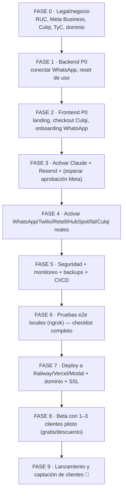

# 11 · Roadmap a producción (TODO lo que falta + costos)

> Documento maestro: **todo** lo que falta para que AgentePro 2.0 esté en producción y listo para buscar clientes — backend, frontend, interfaz visual, legal, infraestructura, pruebas y **costos de cada cosa** (únicos, fijos mensuales y variables por cliente), en el **orden** en que se debe implementar y probar.

> ⚠️ Los precios son **estimaciones de planificación a 2026** en USD (y PEN donde aplica). Verifica cada uno en la web del proveedor antes de comprometer dinero. Tipo de cambio asumido: **1 USD ≈ S/ 3.75**.

---

## 0. Estado actual (línea base honesta)

| Capa | % aprox. listo | Comentario |
|------|----------------|------------|
| Backend (API, webhooks, servicios, IA, provisioning) | **~85%** | Corre, importa, 18 tests, migraciones OK. Faltan piezas (abajo) |
| Frontend (dashboard funcional) | **~70%** | 11 páginas funcionan; falta pulido visual, landing, checkout, gestión |
| Integraciones externas | **~0% activadas** | Código listo; faltan las API keys y la aprobación de Meta |
| Infra / DevOps | **~30%** | Docker local OK; falta dominio, SSL, monitoreo, backups, CI/CD |
| Legal / negocio | **~0%** | Falta empresa/RUC, términos, privacidad, verificación Meta |

**Conclusión:** el producto **técnicamente funciona end-to-end**, pero para **cobrar a clientes reales** falta sobre todo: (1) activar e integrar servicios reales, (2) la aprobación de WhatsApp Business API de Meta, (3) lo legal, (4) pulido de interfaz + landing/checkout, (5) operación (dominio, monitoreo, backups).

### Prioridades
- **P0** = bloquea el lanzamiento. **P1** = importante para cobrar con confianza. **P2** = mejora / escala.

---

## 1. Tabla maestra de lo que falta

| # | Falta | Capa | Prioridad | Esfuerzo | Costo asociado |
|---|-------|------|-----------|----------|----------------|
| 1 | Endpoint para conectar WhatsApp del tenant (guardar `phone_number_id` + token cifrado) | Backend | **P0** | S | — |
| 2 | Flujo de onboarding que use ese endpoint (pegar credenciales + verificar) | Frontend | **P0** | M | — |
| 3 | Aprobación de **WhatsApp Business API** (Meta Business verification) | Legal/Integración | **P0** | L (semanas) | $0 (tiempo) |
| 4 | Activar `ANTHROPIC_API_KEY` y validar respuestas reales | Integración | **P0** | S | variable (ver §8) |
| 5 | **Landing page** de marketing + captura de leads | Frontend | **P0** | M | dominio |
| 6 | **Checkout con Culqi** (formulario de tarjeta/Yape → `/provision`) | Front+Back | **P0** | M | comisión Culqi |
| 7 | Términos de servicio + Política de privacidad | Legal | **P0** | S | $0–$200 (abogado) |
| 8 | Empresa formal + RUC (para Culqi y facturar) | Legal | **P0** | M | ~S/ 0–500 |
| 9 | Dominio + SSL + DNS | Infra | **P0** | S | ~$12/año |
| 10 | Reset de contador de uso mensual (`messages_used_this_month`) | Backend | **P0** | S | — |
| 11 | Rate limiting real (Redis) en auth y webhooks | Backend | P1 | M | — |
| 12 | Subida real a Supabase Storage (grabaciones, imágenes IG) | Backend | P1 | M | incluido en Supabase |
| 13 | Transcripción de audios disparada desde el webhook (no solo Modal) | Backend | P1 | S | OpenAI Whisper |
| 14 | OAuth de Instagram (callback + guardar token) | Backend | P1 | M | — |
| 15 | Acciones del webhook de Culqi (renovar/desactivar suscripción) | Backend | P1 | M | — |
| 16 | Manejo de ventana de 24h de WhatsApp + plantillas (templates) | Backend | P1 | M | costo por plantilla |
| 17 | Reset de contraseña + invitar usuarios al equipo | Front+Back | P1 | M | emails |
| 18 | Monitoreo de errores (Sentry) + uptime + logs centralizados | Infra | P1 | S | $0–$26/mo |
| 19 | Backups automáticos de la base de datos | Infra | P1 | S | incluido/$ |
| 20 | Pulido visual del dashboard (skeletons, mobile, vacíos, animaciones) | Frontend | P1 | L | — |
| 21 | Wizard de 6 pasos del agente + PhonePreview + waveform de audio | Frontend | P2 | M | — |
| 22 | Kanban con drag&drop real + calendario de Instagram | Frontend | P2 | M | — |
| 23 | Métricas reales (citas agendadas, tiempo de respuesta real) | Backend | P2 | M | — |
| 24 | CI/CD (tests + deploy automático) | Infra | P2 | M | $0 (GitHub Actions) |
| 25 | Code splitting del frontend (bundle 900KB → chunks) | Frontend | P2 | S | — |
| 26 | Panel web de super admin (hoy es por API) | Front+Back | P2 | M | — |
| 27 | Eliminar carpeta duplicada `backend/utils/` (residual) | Backend | P2 | XS | — |
| 28 | Suite de tests de integración (DB + e2e) | QA | P1 | L | — |

> Esfuerzo: XS (<1h) · S (½–1 día) · M (2–4 días) · L (1–3 semanas).

---

## 2. FASE 0 — Negocio y legal (antes de tocar código)

> Esto **bloquea** el lanzamiento real porque Meta y Culqi lo exigen. Empieza ya, corre en paralelo al desarrollo.

| Paso | Acción | Costo | Tiempo |
|------|--------|-------|--------|
| 0.1 | Constituir empresa o usar persona natural con negocio + **RUC** (SUNAT) | S/ 0–500 | 1–7 días |
| 0.2 | Abrir **Meta Business Manager** y verificar el negocio (documentos) | $0 | días–semanas |
| 0.3 | Crear cuenta **Culqi** (requiere RUC/datos del negocio) | $0 | 1–3 días |
| 0.4 | Redactar **Términos de Servicio** y **Política de Privacidad** (Meta los exige con URL pública) | $0–$200 | 1–2 días |
| 0.5 | Definir marca: nombre, logo, dominio (`agentepro.pe` o similar) | dominio ~$12/año | 1 día |
| 0.6 | Cuenta bancaria del negocio para recibir cobros de Culqi | $0 | días |

**Entregable:** RUC, Business Manager verificado, Culqi en revisión, TyC/Privacidad publicados, dominio comprado.

---

## 3. FASE 1 — Completar el backend (P0/P1)

### 3.1 Conexión de WhatsApp por tenant (P0) — el gap más importante
Hoy el provisioning **no** guarda las credenciales de WhatsApp del negocio; no existe endpoint para ello. Sin esto, ningún tenant puede enviar/recibir WhatsApp real.

- **Crear** `POST /api/v1/whatsapp/connect` que reciba `phone_number_id`, `waba_id` y `access_token`, **cifre el token con Fernet** (`utils/encryption.py`) y lo guarde en el tenant.
- **Crear** `GET /api/v1/whatsapp/status` que pruebe el token contra la Graph API.
- Reusar `build_client_for_tenant` (ya existe) para validar.
- **Esfuerzo:** S. **Costo:** $0.

### 3.2 Reset de uso mensual (P0)
`messages_used_this_month` / `calls_used_this_month` nunca se reinician → los límites de plan se agotan para siempre.
- Tarea Modal/Celery mensual (cron `0 0 1 * *`) que ponga ambos contadores en 0 para todos los tenants.
- **Esfuerzo:** S.

### 3.3 Rate limiting real (P1)
`RateLimitMiddleware` hoy es passthrough.
- Implementar con Redis (sliding window) por IP y por tenant; máx 5 intentos/min en `/auth/login`.
- **Esfuerzo:** M.

### 3.4 Storage real en Supabase (P1)
- Subir grabaciones de llamadas e imágenes de IG a Supabase Storage y guardar la URL firmada.
- Hoy `recording_url` viene de Retell y la imagen de fal.ai no se re-aloja.
- **Esfuerzo:** M.

### 3.5 Transcripción de audios en el flujo (P1)
- Cuando llega un audio de WhatsApp, disparar `transcribe_whatsapp_audio` y pasar el texto al agente (hoy el código existe en Modal pero el webhook no lo invoca).
- **Esfuerzo:** S.

### 3.6 OAuth de Instagram (P1)
- `GET /instagram/connect-url` ya existe; falta el callback `POST /instagram/connect` que intercambie el `code` por token y lo guarde cifrado.
- **Esfuerzo:** M.

### 3.7 Webhook de Culqi con acciones (P1)
- Hoy clasifica el evento pero no actúa. Implementar: renovar suscripción, marcar `past_due`, desactivar tenant con 7 días de gracia, notificar por WhatsApp/email.
- **Esfuerzo:** M.

### 3.8 Ventana de 24h + plantillas de WhatsApp (P1)
- Fuera de la ventana de 24h, Meta solo permite **mensajes de plantilla** aprobados. Implementar envío de templates y registrar plantillas.
- **Esfuerzo:** M. **Costo:** por plantilla enviada (ver §8).

### 3.9 Métricas reales (P2)
- `appointments_booked` y `avg_response_time_minutes` están fijos. Calcularlos desde datos reales.
- **Esfuerzo:** M.

### 3.10 Limpieza (P2)
- Borrar `backend/utils/` duplicado (lo válido es `backend/app/utils/`).

---

## 4. FASE 2 — Frontend e interfaz visual

### 4.1 Landing page para captar clientes (P0)
Sin esto no hay cómo "buscar clientes".
- Página pública: propuesta de valor, demo/video, planes y precios, testimonios, FAQ, CTA "Empieza ahora".
- Puede ser parte del mismo Vite (ruta `/`) o un sitio aparte. **Esfuerzo:** M.

### 4.2 Checkout con Culqi (P0)
- Formulario de pago (Culqi Checkout / tarjeta + Yape) → genera `culqi_token` → llama `POST /api/v1/provision`.
- Página de "registro + pago" que dispara el auto-provisioning.
- **Esfuerzo:** M.

### 4.3 Onboarding real de WhatsApp (P0)
- Conectar el wizard de onboarding al nuevo `POST /whatsapp/connect` (§3.1): pegar Phone Number ID + token, botón "Verificar conexión" con indicador ✅/❌.
- **Esfuerzo:** M.

### 4.4 Pulido visual del dashboard (P1)
- Estados de carga (skeletons), estados vacíos atractivos, animaciones suaves, **responsive móvil**, modo claro opcional.
- Mejorar tipografía/espaciados, micro-interacciones, tooltips.
- **Esfuerzo:** L.

### 4.5 Componentes avanzados que faltan vs. el diseño original (P2)
- Wizard de 6 pasos del agente (hoy es un formulario simple).
- `PhonePreview` (vista tipo celular del chat), `AudioPlayer` con waveform.
- Kanban de contactos con **drag & drop** real.
- **Calendario** mensual de Instagram (hoy es grid).
- Gráficos adicionales (embudo animado, sparklines en KPIs).
- **Esfuerzo:** M–L.

### 4.6 Gestión de cuenta (P1)
- Cambiar contraseña, editar perfil, invitar usuarios al equipo, ver/gestionar suscripción y método de pago.
- **Esfuerzo:** M.

### 4.7 Calidad de frontend (P2)
- `ErrorBoundary`, **code splitting** (bundle de 900KB → lazy por ruta), accesibilidad básica, favicon/manifest/SEO en la landing.
- **Esfuerzo:** S–M.

---

## 5. FASE 3 — Activar integraciones reales (en este orden)

| Orden | Integración | Qué desbloquea | Bloqueante |
|-------|-------------|----------------|------------|
| 1 | **Anthropic (Claude)** | El agente responde de verdad | — |
| 2 | **Resend** | Emails de bienvenida/alertas | dominio (DNS) |
| 3 | **Meta WhatsApp Business API** | El canal principal | **verificación de Meta (P0, lento)** |
| 4 | **HubSpot** | CRM real | — |
| 5 | **Twilio + Retell** | Voz | número + saldo |
| 6 | **fal.ai** | Imágenes de Instagram | — |
| 7 | **Culqi** | Cobros reales | RUC aprobado |
| 8 | **OpenAI** | Transcripción de audios | — |

> La **aprobación de WhatsApp Business API** es lo que más tarda (verificación de negocio + revisión). Empiézala en la Fase 0.

Después de cada activación: `docker compose restart backend worker` y validar con `GET /api/v1/admin/health`.

---

## 6. FASE 4 — Seguridad, observabilidad y calidad

| Item | Acción | Costo |
|------|--------|-------|
| Secretos fuertes | Cambiar `SECRET_KEY` y `ADMIN_SECRET_KEY` (`openssl rand -hex 32`) | $0 |
| `DEBUG=false` en prod | Oculta `/docs`, baja verbosidad | $0 |
| **Sentry** | Captura de errores backend + frontend | $0 (dev) / ~$26/mo |
| **Uptime** | Better Stack / UptimeRobot | $0–$20/mo |
| Backups DB | Snapshots automáticos (Supabase/Railway) | incluido/$ |
| HTTPS | Certificados (Vercel/Railway lo dan) | $0 |
| CORS/dominios | `FRONTEND_URL` real, orígenes Socket.io | $0 |
| Tests de integración | DB de prueba + e2e de los flujos clave | $0 |
| CI/CD | GitHub Actions: tests + deploy | $0 |
| Rate limiting | (ver §3.3) | $0 |

---

## 7. FASE 5 — Pruebas locales completas antes de producción

Checklist e2e (con keys reales en `.env` local + ngrok para webhooks):

```bash
# Exponer el backend local para los webhooks reales
ngrok http 8000
```

- [ ] Registro + checkout con Culqi (modo test) → auto-provisioning completo.
- [ ] Conectar WhatsApp real (Phone Number ID + token) y verificar webhook (GET challenge).
- [ ] Enviar un WhatsApp real → Claude responde → aparece en el dashboard en vivo.
- [ ] Escalado a humano → toast + email.
- [ ] Tomar control / devolver a IA.
- [ ] Llamada entrante real → Retell contesta → transcript + resumen.
- [ ] Llamada saliente desde el dashboard.
- [ ] Lead caliente → contacto + deal en HubSpot.
- [ ] Generar post de IG con imagen real (fal.ai) → aprobar → publicar.
- [ ] Automatización de follow-up (Modal) corre y envía.
- [ ] Reset de uso mensual.
- [ ] Reintento/duplicado de webhook ignorado correctamente.
- [ ] Cancelación de suscripción (Culqi) → gracia → desactivación.
- [ ] `pytest` y `npm run build` en verde.

---

## 8. 💰 COSTOS — todo, en detalle

### 8.1 Costos ÚNICOS (setup inicial)
| Concepto | Costo aprox. |
|----------|--------------|
| RUC / formalización (persona natural con negocio) | S/ 0–500 |
| Dominio (.pe o .com) primer año | $12–$25 |
| Logo / marca (Canva/freelance) | $0–$100 |
| Términos y Privacidad (plantilla o abogado) | $0–$200 |
| **Total único** | **~$50–$300 + S/0–500** |

### 8.2 Costos FIJOS mensuales (infraestructura que TÚ pagas)
| Servicio | Plan | Costo/mes |
|----------|------|-----------|
| **Railway** (backend + worker) | Hobby/Pro | $5–$20 |
| **Vercel** (frontend/landing) | Hobby/Pro | $0–$20 |
| **Supabase** (Postgres + Storage) | Free/Pro | $0–$25 |
| **Redis** (Upstash/Railway addon) | Free/Pro | $0–$10 |
| **Modal** (crons) | Free tier + uso | $0–$10 |
| **Resend** (emails) | Free 3k/Pro | $0–$20 |
| **Sentry** (errores) | Free/Team | $0–$26 |
| **Dominio** (prorrateado) | — | ~$1–$2 |
| **Total fijo** | — | **~$11–$133/mes** |

> Al arranque (pocos clientes) puedes vivir en **planes gratuitos**: ~**$5–$25/mes** reales (solo Railway + dominio).

### 8.3 Costos VARIABLES por cliente (APIs según uso)
Estimaciones por **conversación/llamada/post** (verificar tarifas vigentes):

| API | Unidad | Costo aprox. |
|-----|--------|--------------|
| **Claude** (Sonnet) | 1M tokens entrada / salida | $3 / $15 → ~**$0.01–$0.05 por conversación** |
| **Meta WhatsApp** | conversación de servicio (user-initiated) | **$0** (gratis) en muchos casos |
| **Meta WhatsApp** | mensaje de plantilla (marketing/utility) Perú | ~$0.005–$0.06 c/u |
| **Twilio** | número telefónico | ~$1–$5/mes |
| **Twilio** | minuto de voz (entrante/saliente) | ~$0.013–$0.022/min |
| **Retell AI** | minuto de conversación de voz | ~$0.07–$0.10/min |
| **fal.ai** (flux schnell) | imagen | ~$0.003 c/u |
| **OpenAI Whisper** | minuto de audio | ~$0.006/min |
| **HubSpot Free** | — | $0 |
| **Culqi** | por transacción (cobro mensual del cliente) | **~3.99% + S/0.50** |

### 8.4 Costo estimado de APIs por cliente/mes (por plan)
| Componente | Basic (500 msg / 30 llam) | Professional (2k / 100) | Enterprise (∞/∞ uso justo) |
|------------|---------------------------|--------------------------|----------------------------|
| Claude | ~$5 | ~$16 | ~$32 |
| Twilio (número + min) | ~$3 | ~$9 | ~$19 |
| Retell (voz) | ~$4 | ~$12 | ~$24 |
| fal.ai (IG) | — | ~$2 | ~$3 |
| WhatsApp plantillas | ~$1 | ~$3 | ~$6 |
| Otros (Resend/Whisper) | ~$1 | ~$2 | ~$3 |
| **Costo APIs / cliente** | **~$14 (S/53)** | **~$44 (S/165)** | **~$87 (S/326)** |
| Comisión Culqi (sobre venta) | ~S/8 | ~S/14 | ~S/22 |

### 8.5 Economía por plan (unit economics)
| Plan | Precio venta | Costo APIs | **Ganancia** |
|------|-------------|-----------|------------------|
| Inicial | S/ 149 | ~S/ 14 | **~S/ 135 (91%)** |
| Basic | S/ 249 | ~S/ 24 | **~S/ 225 (90%)** |
| Professional | S/ 449 | ~S/ 173 | **~S/ 276 (61%)** |
| Enterprise | S/ 799 | ~S/ 435 | **~S/ 365 (46%)** |

(Cobro por Yape, sin comisión Culqi. Costos = consumo real medido; ver `PRICING.md`.)

### 8.6 Punto de equilibrio y proyección
- Costos fijos al inicio ≈ **S/ 40–100/mes** (planes free) → **break-even ≈ 1 cliente**.
- Con infra Pro (~S/ 500/mes) y margen promedio ~S/ 160 → **break-even ≈ 3–4 clientes**.

| Clientes | Ingreso aprox. (S/) | Costo APIs+fijos (S/) | **Utilidad neta aprox. (S/)** |
|----------|---------------------|------------------------|-------------------------------|
| 5 | ~2,900 | ~900 | **~2,000** |
| 10 | ~2,940 | ~1,150 | **~1,800–2,300** |
| 25 | ~7,500 | ~2,400 | **~5,000** |
| 50 | ~15,000 | ~4,500 | **~10,000** |

> Valida el consumo real con `GET /api/v1/metrics/costs` (por tenant) y `GET /api/v1/admin/costs/global`.

---

## 9. Orden recomendado consolidado (paso a paso)



### Resumen del orden
1. **Legal y cuentas** (corre en paralelo, empieza ya — Meta tarda).
2. **Backend P0:** conectar WhatsApp + reset de uso.
3. **Frontend P0:** landing + checkout + onboarding real.
4. **Activar Claude + Resend** (ver el producto vivo).
5. **Activar el resto** conforme se aprueban (Meta, Culqi).
6. **Seguridad/observabilidad/backups/CI**.
7. **Pruebas e2e locales** con ngrok y keys reales (checklist §7).
8. **Deploy a producción** (Railway + Vercel + Modal + dominio).
9. **Piloto** con 1–3 clientes reales (idealmente gratis o con descuento) para detectar fallos.
10. **Lanzar y vender.**

---

## 10. Checklist final "LISTO PARA PRODUCCIÓN"

**Negocio/Legal**
- [ ] RUC y cuenta bancaria activos
- [ ] Meta Business verificado + WhatsApp Business API aprobado
- [ ] Culqi aprobado y en modo live
- [ ] Términos y Política de Privacidad publicados (URL pública)

**Backend**
- [ ] Endpoint de conexión de WhatsApp + verificación
- [ ] Reset mensual de uso
- [ ] Rate limiting real
- [ ] Storage en Supabase funcionando
- [ ] Webhook de Culqi con acciones
- [ ] `SECRET_KEY`/`ADMIN_SECRET_KEY` fuertes, `DEBUG=false`

**Frontend**
- [ ] Landing + checkout Culqi
- [ ] Onboarding conecta WhatsApp real
- [ ] Pulido visual + responsive
- [ ] Gestión de cuenta (password, equipo, suscripción)
- [ ] `npm run build` sin errores

**Infra**
- [ ] Backend en Railway con migraciones automáticas
- [ ] Frontend/landing en Vercel
- [ ] Crons en Modal desplegados
- [ ] Dominio + SSL + DNS (incluye DNS de Resend)
- [ ] Sentry + uptime + backups
- [ ] CI/CD

**Calidad**
- [ ] Checklist e2e §7 completo en verde
- [ ] 1–3 clientes piloto sin incidencias

> Cuando todo esté marcado: **estás listo para buscar clientes** 🚀

## Volver
🏠 [Índice de documentación](README.md)
